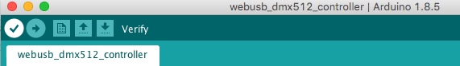
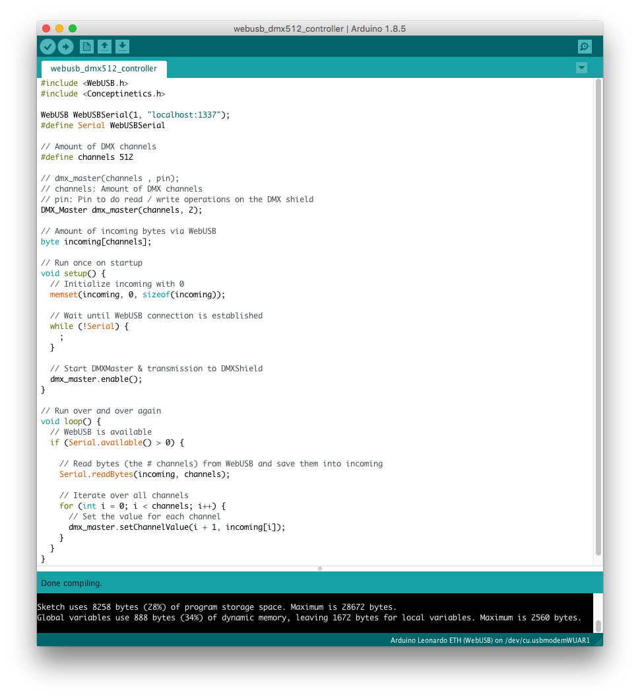

# WebUSB DMX512 Controller

Do you want to build your own DMX512 controller? And use it directly in the browser by leveraging WebUSB? Then you come to the right place!

1. Build your own [WebUSB DMX512 Controller](#hardware)
2. [Open the demo page](https://nerddisco.github.io/WebUSB-DMX512-Controller)

---


## Hardware

* 1 x [Arduino Leonardo](https://store.arduino.cc/arduino-leonardo-with-headers) / Arduino Leonardo ETH (because it has the [ATmega32u4](http://www.microchip.com/wwwproducts/en/ATmega32U4) chip which makes it possible for the computer to recognize the Arduino as an external USB device)
* 1 x ["2.5kV Isolated DMX512 Shield for Arduino - R2"](https://www.tindie.com/products/Conceptinetics/25kv-isolated-dmx-512-shield-for-arduino-r2/)


## Software

### Arduino

1. Clone this repository to your computer: `git clone git@github.com:NERDDISCO/WebUSB-DMX512-Controller.git`
2. Download & install the [Arduino IDE](https://www.arduino.cc/en/Main/Software) >= 1.8.5, so you are able to write & push code onto the Arduino
3. Open the Arduino IDE
4. Open the preferences: *Arduino / Preferences*
5. In the preferences dialog you have to change the *Sketchbook location* so that it points to the *sketchbook* folder that comes with the repository:
  
6. Close the Arduino IDE and then open it again (this is needed to load the new sketchbook that we selected in the step before)
7. Now we need to configure the Arduino IDE so that it can recognize our Arduino Leonardo:
  1. Select the model: *Tools / Board / Arduino Leonardo (WebUSB)*
  2. Select the USB port: *Tools / Port / /dev/tty.usbmodemWUAR1* (This should be something with *usb* in the name and can be different on your computer.

    Note: This can only be selected if your Arduino Leonardo is attached to your computer!)
8. Open the sketch (if it's not already open): *File / Sketchbook / webusb_dmx512_controller*

If all the steps are done, you should now be able to verify the sketch by pushing the *verify* button (check mark icon) in the top left of the sketch:



Which will produce an output like this:

```bash
Sketch uses 8258 bytes (28%) of program storage space. Maximum is 28672 bytes.
Global variables use 888 bytes (34%) of dynamic memory, leaving 1672 bytes for local variables. Maximum is 2560 bytes.
```




### Browser

1. Download and install [Google Chrome](https://www.google.com/chrome/) >= 63 (because it's the only browser with native WebUSB support)
2. asdf


---

# In depth

* [Coding reference](https://www.arduino.cc/en/Reference/HomePage)

## Update the USB version in Arduino IDE

**Attention**: You don't need to do this if you are using the [sketchbook](sketchbook) as provided in this repository.

* Upgrade the Arduino IDE from USB 2.0 to 2.1: Go into the installation directory of your Arduino IDE and open `hardware/arduino/avr/cores/arduino/USBCore.h`. Then find the line `#define USB_VERSION 0x200` and change `0x200` to `0x210`. (@see [Step 3](https://github.com/webusb/arduino#getting-started))

## Using other boards

1. Start the Arduino IDE
2. [Find out which Arduino you are using or to which Arduino your microcontroller is compatible to](#which-arduino-do-i-have)
3. [Use the instructions](https://www.arduino.cc/en/Guide/HomePage) provided for your model (for example [Leonardo / Micro](https://www.arduino.cc/en/Guide/ArduinoLeonardoMicro)) to configure the Arduino IDE
   1. Select the model: Tools -> Board
   2. Select the USB port: Tools -> Port

## Which Arduino do I have?

### Google Chrome

Chrome provides a build-in device-log `chrome://device-log` which can be used to identify the connected USB device:

```
[21:46:31] USB device added: vendor=10755 "Unknown", product=32832 "Arduino Leonardo ETH", serial="WUART", guid=fb98cfd4-48aa-4795-b439-ecc736986cee
```

* `vendor=10755`: The ID of the USB device Vendor
* `product=32832`: The ID of the USB device
* `"Arduino Leonardo ETH"`: The exact name of the USB device

`vendor` & `product` can be [converted to hex](#convert-decimal-to-hex) in order to use them as a filter for WebUSB.


### MacOS

* Connect the Arduino via USB to your computer
* Execute the following command:

```
ioreg -p IOUSB -w0 -l
```

This will list all USB devices, for example (which means you have an "Arduino Micro"):

```
    +-o Arduino Micro@14100000  <class AppleUSBDevice, id 0x100002626, registered, matched, active, busy 0 (40 ms), retain 22>
        {
          "sessionID" = 119957228755640
          "iManufacturer" = 1
          "bNumConfigurations" = 1
          "idProduct" = 32823
          "bcdDevice" = 256
          "Bus Power Available" = 500
          "USB Address" = 21
          "bMaxPacketSize0" = 64
          "iProduct" = 2
          "iSerialNumber" = 3
          "bDeviceClass" = 239
          "Built-In" = No
          "locationID" = 336592896
          "bDeviceSubClass" = 2
          "bcdUSB" = 528
          "USB Product Name" = "Arduino Micro"
          "PortNum" = 1
          "non-removable" = "no"
          "IOCFPlugInTypes" = {"9dc7b780-9ec0-11d4-a54f-000a27052861"="IOUSBFamily.kext/Contents/PlugIns/IOUSBLib.bundle"}
          "bDeviceProtocol" = 1
          "IOUserClientClass" = "IOUSBDeviceUserClientV2"
          "IOPowerManagement" = {"DevicePowerState"=0,"CurrentPowerState"=3,"CapabilityFlags"=65536,"MaxPowerState"=4,"DriverPowerState"=3}
          "Device Speed" = 1
          "USB Vendor Name" = "Arduino LLC"
          "idVendor" = 9025
          "IOGeneralInterest" = "IOCommand is not serializable"
          "USB Serial Number" = "WUART"
          "IOClassNameOverride" = "IOUSBDevice"
        }
```

* `USB Product Name`: The exact name of the USB device
* `idVendor`: The ID of the USB device Vendor (for example Arduino LLC)
* `idProduct`: The ID of the USB device

`idVendor` & `idProduct` can be [converted to hex](#convert-decimal-to-hex) in order to use them as a filter for WebUSB.

---

## Arduino Shield: 2.5kV Isolated DMX 512

* Shield: https://www.tindie.com/products/Conceptinetics/25kv-isolated-dmx-512-shield-for-arduino-r2/
* http://dmxshield.blogspot.de/2013/04/conceptinetics-dmx-library-for-arduino.html#comment-form

### Library: Conceptinetics

* [Documentation](https://sourceforge.net/p/dmxlibraryforar/wiki/)
* [DMX library for Arduino](https://sourceforge.net/projects/dmxlibraryforar/)

### Update to newer version

The following steps are not needed (if you are using an Arduino Leonardo ETH), because you can find an [updated version of the Conceptinetics lib](sketchbook/libraries/Conceptinetics) already in this repo.

* Install the lib into your Arduino library folder
* Change the following lines in `Conceptinetics.h`

```c
// Fix some settings for Arduino Leonardo ETH  
// https://sourceforge.net/p/dmxlibraryforar/wiki/Getting%20DMX%20library%20to%20work%20on%20Arduino%20Leonardo/
// Comment this line
// #define USE_DMX_SERIAL_0

// Uncomment this line
#define USE_DMX_SERIAL_1

// Decrease the length of the automatic baudrate breaks  
// Comment this line
// #define DMX_BREAK_RATE 	 	    49950

// Uncomment this line
#define DMX_BREAK_RATE 	 	    99900
```

---

## Convert decimal to hex

In JavaScript you can convert a decimal number into a hex like this (e.g. in the console of your browser):

```js
let vendorId = 10755
vendorId.toString(16) // 2a03

let productId = 32832
productId.toString(16) // 8040
```

These values with the prefix `0x` can be used as a filter when you request access to a specific USB device:

```js
navigator.usb.requestDevice({
  filters: [{
      'vendorId': 0x2a03,
      'productId': 0x8040
  }]
}).then(device => console.log(device))
```

---

## WebUSB

### Browser Support

#### Chrome 61 + 62

* Native support for ES6 modules
* Enable flags for WebUSB
  * chrome://flags/#enable-experimental-web-platform-features

#### Chrome 63+

* Native support for WebUSB


---

## Random

* Sketch
  * One with many prints
  * One for "production"
* WebUSB code for the browser
* A way to use the code locally
* Get the latest library from github/webusb/arduino
